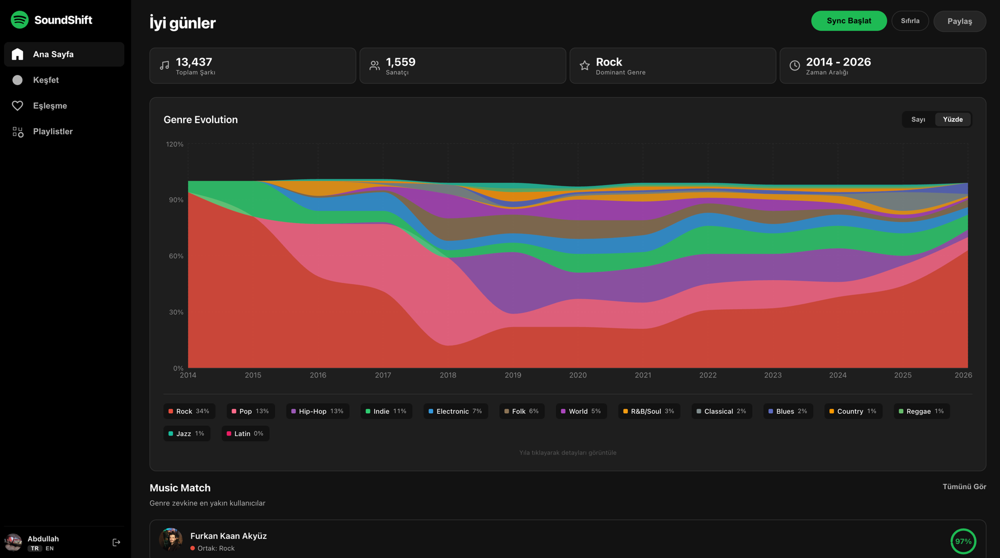
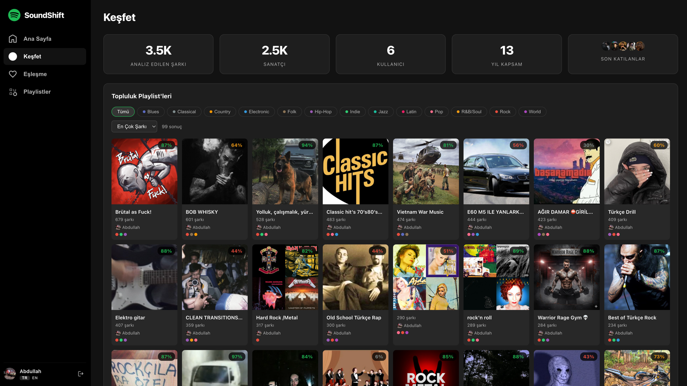
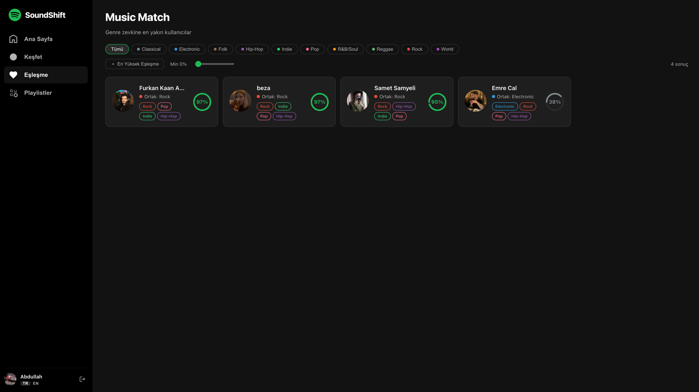
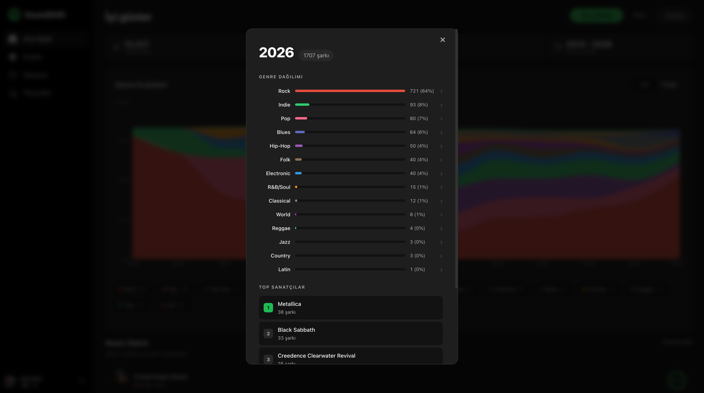

<div align="center">

# SoundShift

**Discover how your music taste evolved over the years.**

Analyze your Spotify library, explore genre trends, compare tastes with friends, and share your musical journey.

[](https://soundshift-4no7.onrender.com)

</div>

---

## Screenshots

<div align="center">
<table>
<tr>
<td width="50%"></td>
<td width="50%"></td>
</tr>
<tr>
<td align="center"><strong>Genre Evolution Timeline</strong></td>
<td align="center"><strong>Explore & Community Playlists</strong></td>
</tr>
<tr>
<td width="50%"></td>
<td width="50%"></td>
</tr>
<tr>
<td align="center"><strong>Music Match</strong></td>
<td align="center"><strong>Year Detail & Genre Breakdown</strong></td>
</tr>
</table>
</div>

## Features

### Genre Evolution Timeline
- Interactive stacked area chart showing your genre distribution year by year
- Click any year to see detailed breakdown: top artists, genre percentages, first & last liked song
- Drill down into any genre to see all songs tagged with it

### Music Match
- Cosine similarity algorithm compares your genre profile with other users
- Combined scoring: 60% liked songs + 40% playlist overlap
- Filter by genre, sort by match percentage, set minimum threshold

### Playlist Analysis
- Full playlist sync with genre distribution per playlist
- Compatibility score showing how each playlist matches your overall taste
- Community playlists with genre filters and sorting

### Explore
- Community stats: total songs, artists, users, time span
- Top artists with song lists and "liked by" indicators
- Genre breakdown across all users
- Community playlists with genre filters

### Share
- Generate shareable cards with your stats, top genres, and timeline
- Multiple formats: square, wide, story
- Download as image or share via Web Share API

### Spotify Data Upload
- Bypass Spotify's 5-user development mode limit
- Upload your Spotify GDPR data export (ZIP)
- Full analysis pipeline: track details, genre enrichment, timeline computation

## Tech Stack

| Layer | Technology |
|-------|-----------|
| **Frontend** | React 19 + Vite + Recharts |
| **Backend** | Node.js + Express |
| **Database** | Supabase (PostgreSQL) |
| **Genre Enrichment** | Spotify API + Last.fm + MusicBrainz |
| **Auth** | Spotify OAuth 2.0 (PKCE) |
| **Deployment** | Render |

## Architecture

```
Client (React SPA)           Server (Express)
├── Hash-based routing       ├── OAuth + PKCE auth
├── SSE for sync progress    ├── Rate-limited API pipeline
├── html2canvas for sharing  ├── Multi-source genre enrichment
└── i18n (EN/TR)             │   ├── Spotify → genres
                             │   ├── Last.fm → top tags
                             │   └── MusicBrainz → fallback
                             ├── Cosine similarity matching
                             ├── Incremental sync (snapshot_id)
                             └── Client credentials for uploads
```

## Getting Started

### Prerequisites

- Node.js 18+
- [Spotify Developer](https://developer.spotify.com/dashboard) app
- [Last.fm API](https://www.last.fm/api/account/create) key
- [Supabase](https://supabase.com) project (free tier works)

### Setup

**1. Clone and install**

```bash
git clone https://github.com/user/soundshift.git
cd soundshift
npm install
cd client && npm install && cd ..
```

**2. Database**

Run `supabase-schema.sql` in the Supabase SQL Editor.

**3. Spotify Dashboard**

Create an app at [developer.spotify.com](https://developer.spotify.com/dashboard).
Add redirect URI: `http://127.0.0.1:3001/auth/callback`

**4. Environment**

```bash
cp .env.example .env
```

```env
SPOTIFY_CLIENT_ID=your_client_id
SPOTIFY_SECRET_KEY=your_client_secret
LASTFM_API_KEY=your_lastfm_key
REDIRECT_URI=http://127.0.0.1:3001/auth/callback
FRONTEND_URL=http://127.0.0.1:5173
SUPABASE_URL=https://xxx.supabase.co
SUPABASE_SERVICE_ROLE_KEY=your_service_role_key
```

**5. Run**

```bash
npm run dev
```

Open `http://127.0.0.1:5173`

### Deploy (Render)

1. Push to GitHub
2. [render.com](https://render.com) → New Web Service → connect repo
3. `render.yaml` auto-detected
4. Add environment variables with production URLs
5. Add production redirect URI to Spotify Dashboard

## How It Works

### Sync Pipeline

```
1. Fetch liked songs (paginated, incremental via last_added_at)
2. Fetch playlists + tracks (skip unchanged via snapshot_id)
3. Enrich artist genres:
   └── Spotify API → Last.fm tags → MusicBrainz fallback
4. Compute timeline (liked songs + playlist tracks, deduplicated)
5. Store timeline JSON in user record
```

### Genre Enrichment

Each artist goes through a 3-tier pipeline:

1. **Spotify** — Artist genres from Spotify's catalog
2. **Last.fm** — Top tags with weighted scoring (min count: 10)
3. **MusicBrainz** — Community-driven tags as final fallback

Tags are normalized to macro genres (Pop, Rock, Hip-Hop, Electronic, etc.) via a curated mapping.

### Match Algorithm

```
similarity = 0.6 * cosine(liked_genres_A, liked_genres_B)
           + 0.4 * avg_cosine(playlists_A, playlists_B)
```

Falls back to 100% liked-songs similarity if either user has no playlists.

## Localization

Supports English and Turkish. Language switch available on all pages.

## License

MIT

---

<div align="center">
<sub>Built with Spotify API, Last.fm, MusicBrainz, and a lot of music.</sub>
</div>
